Harmonization of Individual Samples
================
Tecla Duran Fort
2025-12-03

- <a href="#1-load-data" id="toc-1-load-data">1 Load Data</a>
- <a href="#2-harmonization-of-all-samples"
  id="toc-2-harmonization-of-all-samples">2 Harmonization of all
  samples</a>
- <a href="#3-plot-for-each-sample-and-analyte"
  id="toc-3-plot-for-each-sample-and-analyte">3 Plot for each sample and
  analyte</a>
- <a href="#4-summary-table-of-all-scaleshifterrors"
  id="toc-4-summary-table-of-all-scaleshifterrors">4 Summary table of all
  scale/shift/errors</a>
- <a href="#5-final-plot-scaling-factors-across-samples"
  id="toc-5-final-plot-scaling-factors-across-samples">5 Final plot:
  scaling factors across samples</a>

# 1 Load Data

# 2 Harmonization of all samples

# 3 Plot for each sample and analyte

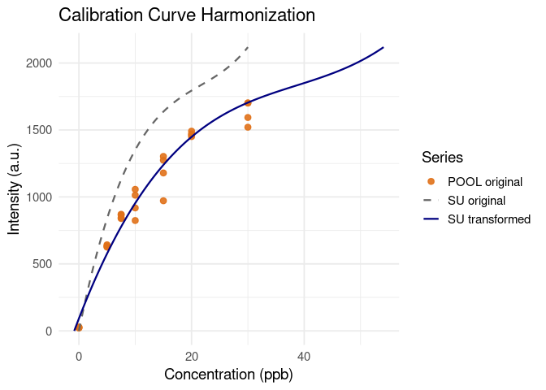<!-- -->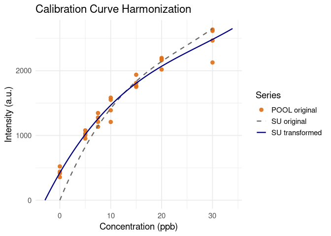<!-- -->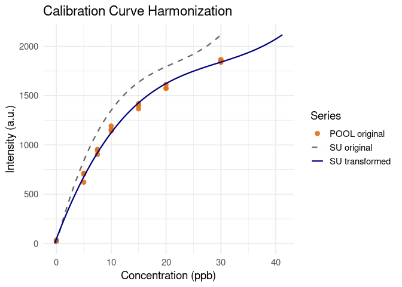<!-- -->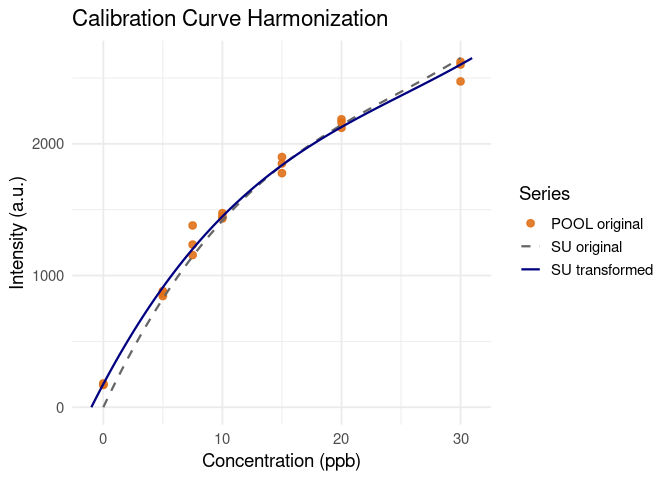<!-- -->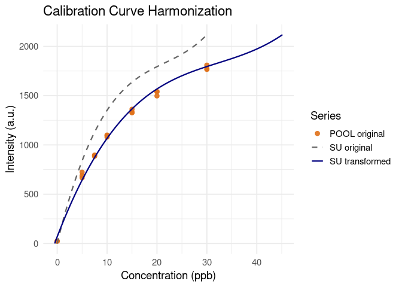<!-- -->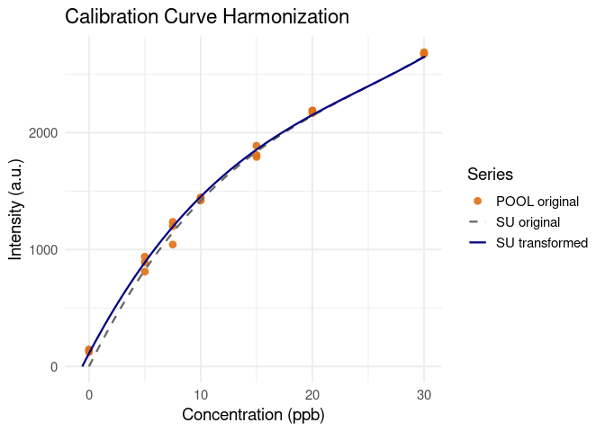<!-- -->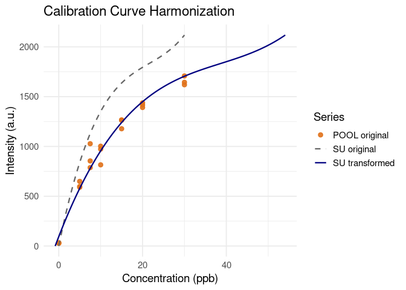<!-- -->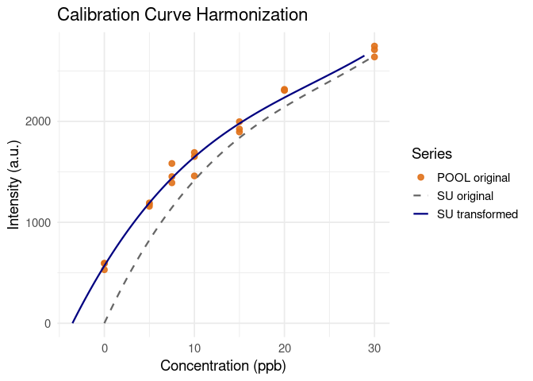<!-- -->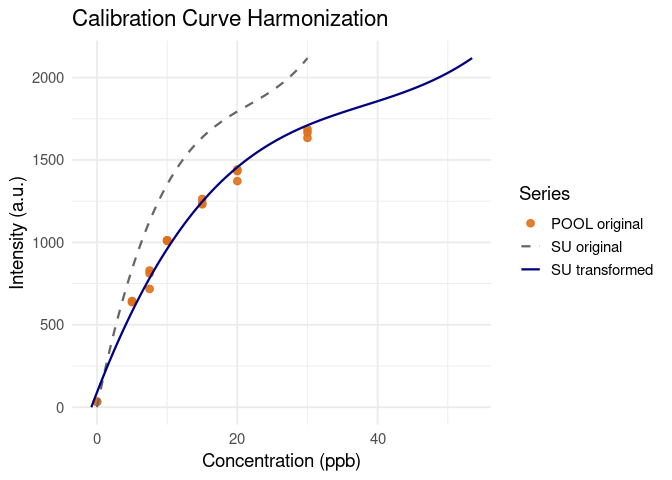<!-- -->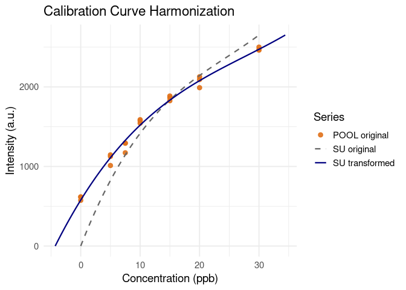<!-- -->

# 4 Summary table of all scale/shift/errors

<table class="table" style="width: auto !important; margin-left: auto; margin-right: auto;">
<caption>

Summary of harmonization parameters

</caption>
<thead>
<tr>
<th style="text-align:left;">

Sample

</th>
<th style="text-align:left;">

Analyte

</th>
<th style="text-align:right;">

Scale

</th>
<th style="text-align:right;">

Shift

</th>
<th style="text-align:right;">

Scale_Error

</th>
<th style="text-align:right;">

Shift_Error

</th>
</tr>
</thead>
<tbody>
<tr>
<td style="text-align:left;">

pool

</td>
<td style="text-align:left;">

anisole

</td>
<td style="text-align:right;">

0.5462

</td>
<td style="text-align:right;">

0.8291

</td>
<td style="text-align:right;">

0.1185

</td>
<td style="text-align:right;">

1.9442

</td>
</tr>
<tr>
<td style="text-align:left;">

pool

</td>
<td style="text-align:left;">

heptanone

</td>
<td style="text-align:right;">

0.8141

</td>
<td style="text-align:right;">

2.9146

</td>
<td style="text-align:right;">

0.1557

</td>
<td style="text-align:right;">

2.2427

</td>
</tr>
<tr>
<td style="text-align:left;">

s1

</td>
<td style="text-align:left;">

anisole

</td>
<td style="text-align:right;">

0.7226

</td>
<td style="text-align:right;">

0.3015

</td>
<td style="text-align:right;">

0.0561

</td>
<td style="text-align:right;">

0.5790

</td>
</tr>
<tr>
<td style="text-align:left;">

s1

</td>
<td style="text-align:left;">

heptanone

</td>
<td style="text-align:right;">

0.9382

</td>
<td style="text-align:right;">

1.0050

</td>
<td style="text-align:right;">

0.0769

</td>
<td style="text-align:right;">

0.8080

</td>
</tr>
<tr>
<td style="text-align:left;">

s2

</td>
<td style="text-align:left;">

anisole

</td>
<td style="text-align:right;">

0.6573

</td>
<td style="text-align:right;">

0.5025

</td>
<td style="text-align:right;">

0.0564

</td>
<td style="text-align:right;">

0.6807

</td>
</tr>
<tr>
<td style="text-align:left;">

s2

</td>
<td style="text-align:left;">

heptanone

</td>
<td style="text-align:right;">

0.9774

</td>
<td style="text-align:right;">

0.6030

</td>
<td style="text-align:right;">

0.0651

</td>
<td style="text-align:right;">

0.6354

</td>
</tr>
<tr>
<td style="text-align:left;">

s3

</td>
<td style="text-align:left;">

anisole

</td>
<td style="text-align:right;">

0.5462

</td>
<td style="text-align:right;">

0.8543

</td>
<td style="text-align:right;">

0.1043

</td>
<td style="text-align:right;">

1.7238

</td>
</tr>
<tr>
<td style="text-align:left;">

s3

</td>
<td style="text-align:left;">

heptanone

</td>
<td style="text-align:right;">

0.9251

</td>
<td style="text-align:right;">

3.5427

</td>
<td style="text-align:right;">

0.0949

</td>
<td style="text-align:right;">

1.2776

</td>
</tr>
<tr>
<td style="text-align:left;">

s4

</td>
<td style="text-align:left;">

anisole

</td>
<td style="text-align:right;">

0.5528

</td>
<td style="text-align:right;">

0.8040

</td>
<td style="text-align:right;">

0.0672

</td>
<td style="text-align:right;">

1.0894

</td>
</tr>
<tr>
<td style="text-align:left;">

s4

</td>
<td style="text-align:left;">

heptanone

</td>
<td style="text-align:right;">

0.7749

</td>
<td style="text-align:right;">

4.2965

</td>
<td style="text-align:right;">

0.0778

</td>
<td style="text-align:right;">

1.3011

</td>
</tr>
</tbody>
</table>

# 5 Final plot: scaling factors across samples

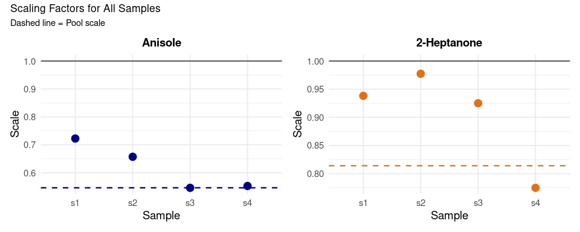<!-- -->
