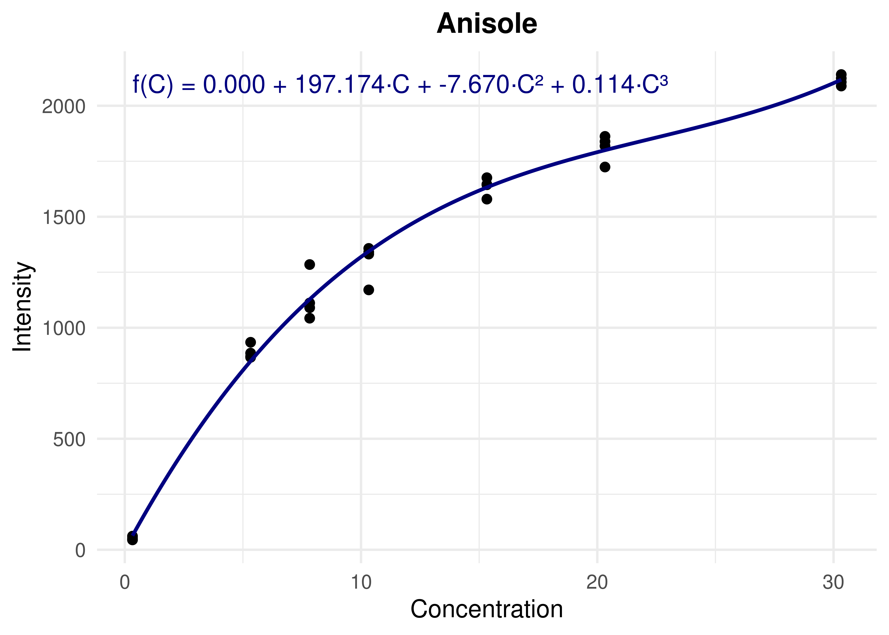
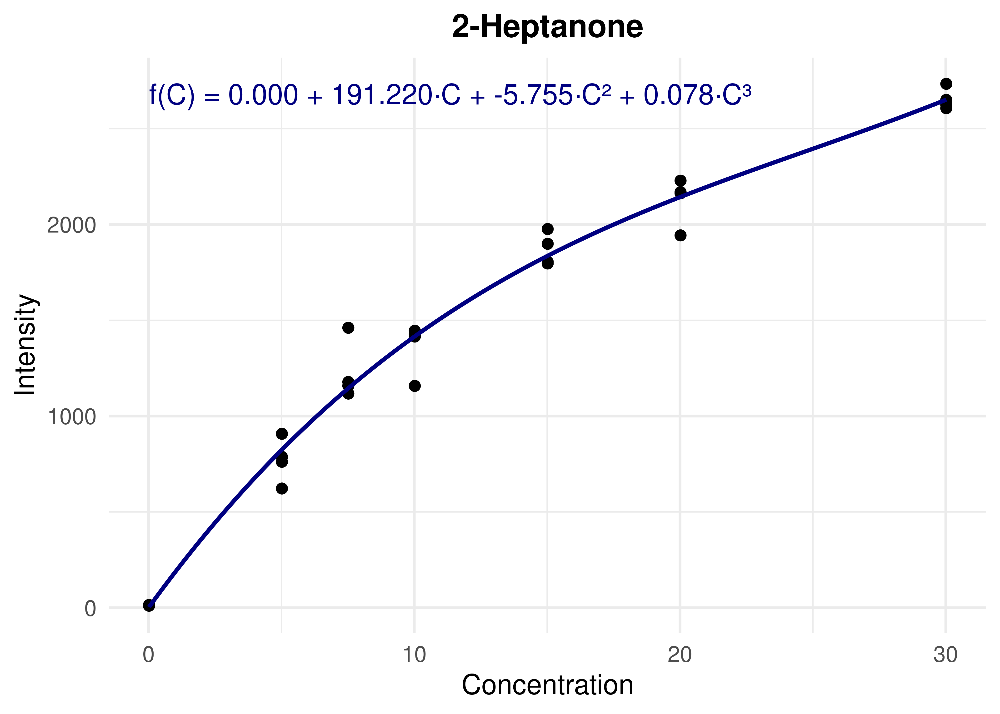
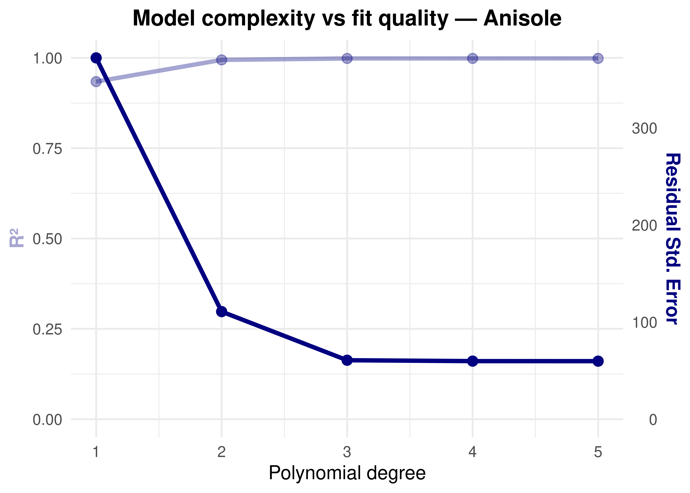
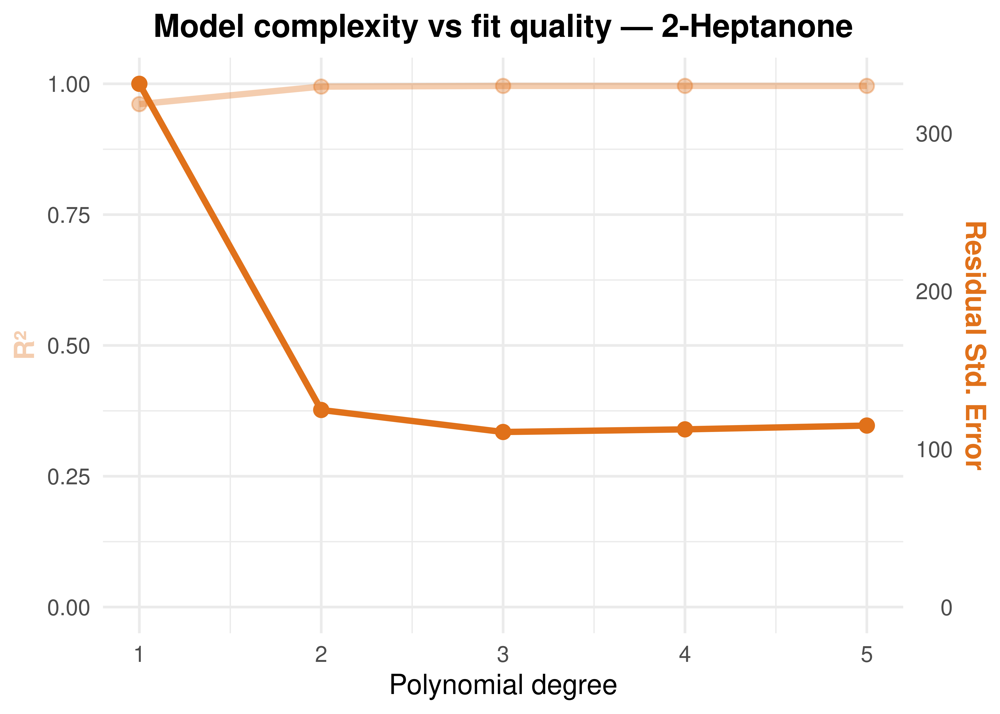
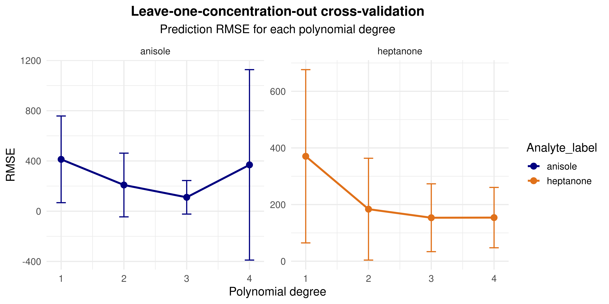

Polynomial Fit
================
Tecla Duran Fort
2025-12-11

<!-- --><!-- -->
\# Polynomial Degree Election

<!-- --><!-- -->
\## Cross Validation

| Analyte   | Degree | Mean RMSE |  SD RMSE |
|:----------|-------:|----------:|---------:|
| anisole   |      1 |  412.7650 | 345.0541 |
| anisole   |      2 |  208.4509 | 253.6002 |
| anisole   |      3 |  110.4531 | 133.4864 |
| anisole   |      4 |  368.7808 | 758.0207 |
| heptanone |      1 |  370.5665 | 305.8793 |
| heptanone |      2 |  183.8062 | 179.7555 |
| heptanone |      3 |  153.5548 | 119.7488 |
| heptanone |      4 |  154.0352 | 106.5369 |

Cross-validation: leave-one-concentration-out RMSE by polynomial degree

<!-- -->
