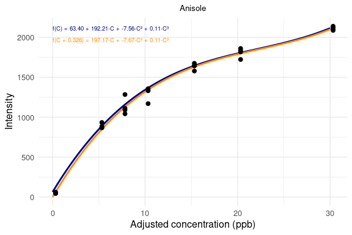
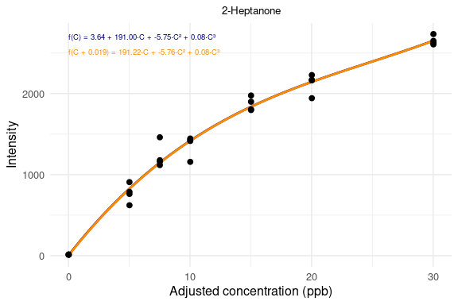

Reference Polynomial Adjustment to Enforce Origin Constraint
================
Tecla Duran Fort
2025-12-02

Before building the calibration models, we apply a small correction to
each SU reference curve to ensure that the fitted polynomial passes
through the origin, based on the assumption that the analyte
concentration in synthetic urine should be zero when no spike is applied
($C = 0 \Rightarrow I = 0$).

However, a **very small peak** in the **anisole** place is consistently
observed in the unspiked SU samples. This signal is absent in real urine
samples. We suspect this may be due to a impurity (still under
investigation). This would lead to negative estimated concentrations in
real samples at low intensity values. Therefore, we shift the SU curves
slightly to enforce the zero-response condition at zero spike. We apply
the same steps to all the analytes for consistency of the method.

To correct for this, we shift the concentration values of each
calibration set by a small value $r_0$ so that the fitted polynomial
satisfies $f(0) = 0$. This shift is kept minimal to avoid excessive
extrapolation beyond the original data range, and it is only applied
when a root $r_0$ is found near zero.

``` r
shift_to_origin <- function(df, analytes, conc_col = "concentration",
                            degree = 3, search_interval = c(-5, 1)) {
  
  df_shifted <- df
  shift_info <- list()
  
  for (analyte in analytes) {
    
    # Prepare small working DF
    tmp <- df %>%
      dplyr::select(all_of(conc_col), all_of(analyte)) %>%
      dplyr::rename(
        concentration = all_of(conc_col),
        intensity = all_of(analyte)
      )
    
    # Fit original polynomial
    fit_poly <- lm(intensity ~ poly(concentration, degree, raw = TRUE), data = tmp)
    coef_poly <- coef(fit_poly)
    
    # Define polynomial function
    f <- function(C) {
      # IMPORTANT: build polynomial of correct length
      powers <- 0:(length(coef_poly)-1)
      sum(coef_poly * C^powers)
    }
    
    # Compute root r0 (try-catch)
    r0 <- NA
    try({
      root_obj <- uniroot(f, lower = search_interval[1], upper = search_interval[2])
      r0 <- root_obj$root
    }, silent = TRUE)
    
    new_col <- paste0("c_", analyte)
    
    if (!is.na(r0)) {
      # Apply shift
      df_shifted[[new_col]] <- df[[conc_col]] - r0
      
      # Build working DF for shifted model
      tmp_shift <- df_shifted %>%
        dplyr::select(all_of(new_col), all_of(analyte)) %>%
        dplyr::rename(
          concentration_shifted = all_of(new_col),
          intensity = all_of(analyte)
        )
      
      # Fit shifted polynomial without intercept
      fit_shifted <- lm(
        intensity ~ poly(concentration_shifted, degree, raw = TRUE) - 1,
        data = tmp_shift
      )
      
      shift_info[[analyte]] <- list(
        r0 = r0,
        fit_poly = fit_poly,
        fit_shifted = fit_shifted,
        coef_original = coef_poly,
        coef_shifted = coef(fit_shifted)
      )
      
    } else {
      # No root found
      df_shifted[[new_col]] <- df[[conc_col]]
      
      shift_info[[analyte]] <- list(
        r0 = NA,
        fit_poly = fit_poly,
        fit_shifted = NULL,
        coef_original = coef_poly,
        coef_shifted = NULL
      )
    }
  }
  
  return(list(
    data = df_shifted,
    shift_info = shift_info
  ))
}
```

``` r
res <- shift_to_origin(su, analytes = c("anisole", "heptanone"))
su <- res$data
shift_info <- res$shift_info
```

<!-- --><!-- -->
