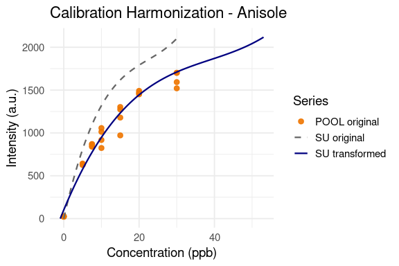
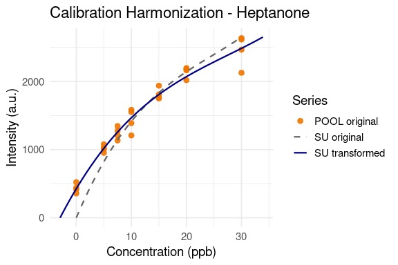
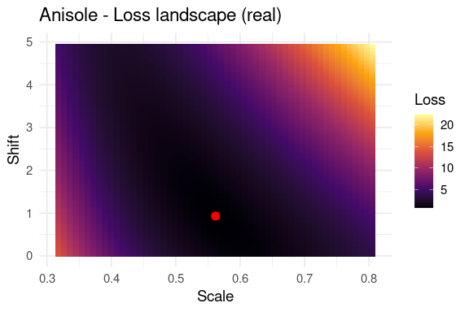
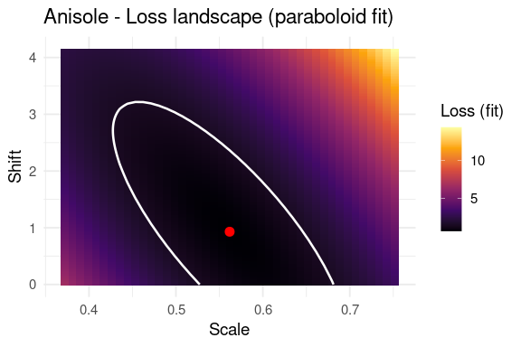
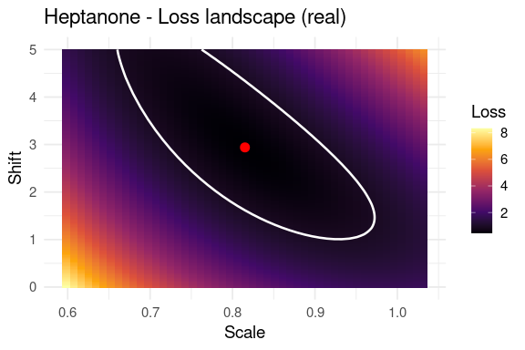
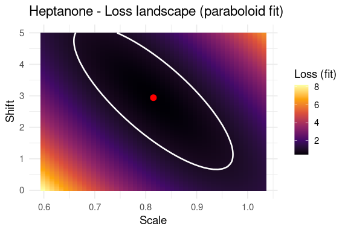
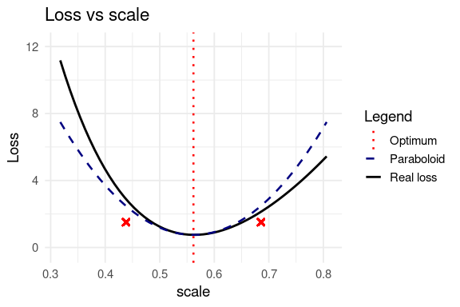
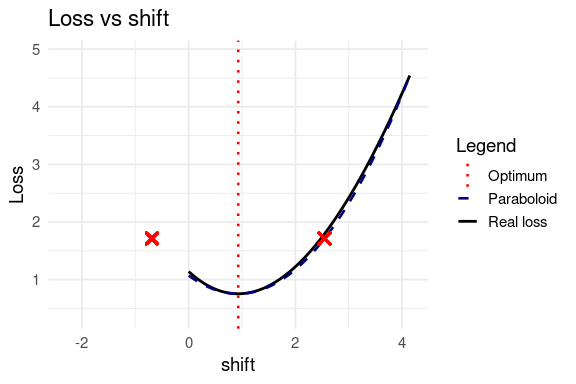
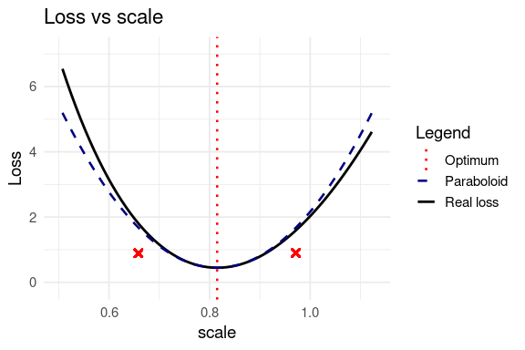
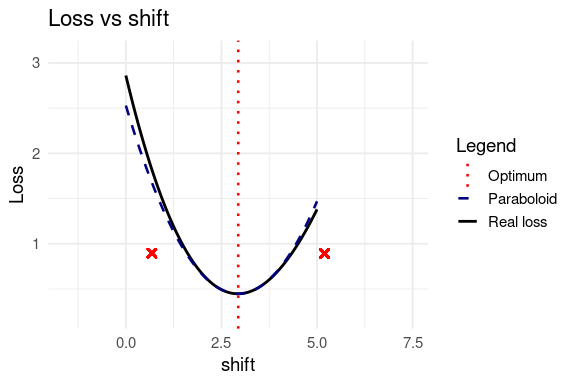

Harmonization Function and Parameter Errors
================
Tecla Duran Fort
2025-12-11

- <a href="#data-loading" id="toc-data-loading">Data loading</a>
- <a href="#harmonization-function"
  id="toc-harmonization-function">Harmonization function</a>
  - <a href="#methodology" id="toc-methodology">Methodology</a>
    - <a href="#loss-function" id="toc-loss-function">Loss function</a>
    - <a href="#quadratic-model-local-paraboloid-approximation"
      id="toc-quadratic-model-local-paraboloid-approximation">Quadratic model
      (local paraboloid approximation)</a>
    - <a href="#covariance-of-st-from-the-hessian"
      id="toc-covariance-of-st-from-the-hessian">Covariance of <span
      class="math inline">(<em>s</em>,<em>t</em>)</span> from the Hessian</a>
    - <a href="#interpretation" id="toc-interpretation">Interpretation</a>
  - <a href="#function-definition" id="toc-function-definition">Function
    definition</a>
    - <a href="#principal-function" id="toc-principal-function">Principal
      Function</a>
    - <a href="#auxiliar-functions" id="toc-auxiliar-functions">Auxiliar
      Functions</a>
- <a href="#visualization-of-harmonized-curves"
  id="toc-visualization-of-harmonized-curves">Visualization of harmonized
  curves</a>
  - <a href="#anisole" id="toc-anisole">Anisole</a>
  - <a href="#heptanone" id="toc-heptanone">Heptanone</a>
- <a href="#loss-landscape-and-paraboloid-approximation"
  id="toc-loss-landscape-and-paraboloid-approximation">Loss landscape and
  paraboloid approximation</a>
  - <a href="#2d-heatmaps-real-loss-vs-paraboloid"
    id="toc-2d-heatmaps-real-loss-vs-paraboloid">2D heatmaps: real loss vs
    paraboloid</a>
    - <a href="#anisole-1" id="toc-anisole-1">Anisole</a>
    - <a href="#heptanone-1" id="toc-heptanone-1">Heptanone</a>
  - <a href="#1d-profiles-loss-vs-scale-and-shift"
    id="toc-1d-profiles-loss-vs-scale-and-shift">1D profiles: loss vs scale
    and shift</a>
    - <a href="#anisole-2" id="toc-anisole-2">Anisole</a>
    - <a href="#heptanone-2" id="toc-heptanone-2">Heptanone</a>

# Data loading

In this document we harmonize calibration curves between two matrices:

- **SU** (reference matrix)
- **POOL** (target matrix to be scaled and shifted)

We work with two analytes: *anisole* and *heptanone*.

    ## 'data.frame':    28 obs. of  2 variables:
    ##  $ concentration: num  10.326 30.326 0.326 20.326 5.326 ...
    ##  $ intensity    : num  1331.8 2088.8 44.6 1862 885.7 ...

    ## 'data.frame':    28 obs. of  2 variables:
    ##  $ concentration: num  10 30 0 20 5 10 30 0 20 5 ...
    ##  $ intensity    : num  1013 1593.2 21.9 1462.2 642.6 ...

# Harmonization function

## Methodology

The objective is to determine the **scale** and **shift** parameters
that optimally transform the SU calibration curve so that it aligns with
the POOL measurements.

The procedure is:

1.  Fit a **third-degree polynomial model** to the SU calibration data
    (no intercept).

2.  Evaluate this polynomial on a dense concentration grid to obtain a
    smooth SU curve.

3.  For each candidate pair *(scale, shift)* in a predefined grid:

    - Transform the SU concentration axis using

$$
C \mapsto \frac{C}{\text{scale}} - \text{shift}
$$

- Interpolate the transformed SU curve onto the POOL concentration
  points.
- Compute a loss value.

4.  Select the *(scale, shift)* pair that **minimises the loss**.
5.  Fit a **local quadratic surface (paraboloid)** to the loss landscape
    around the optimum to estimate parameter uncertainties.

### Loss function

Given measured intensities $I_i$, predicted intensities $\hat{I}_i$, and
optional variance-normalisation denominators $D_i$, the loss for a
candidate pair $(\text{scale}, \text{shift})$ is defined as:

$$
L(\text{scale}, \text{shift}) = \frac{1}{n} \sum_{i=1}^{n} 
\frac{(I_i - \hat{I}_i)^2}{D_i}.
$$

The denominator $D_i$ corresponds to the estimated variance at each
concentration level:

$$
D_i = \begin{cases}
\sigma^2(C_i), & \text{if at least two replicate points exist at concentration } C_i, \\[6pt]
1, & \text{otherwise}.
\end{cases}
$$

Thus, whenever multiple measurements exist at the same concentration
$C_i$, the empirical variance  
$\sigma^2(C_i)$ is used to normalise the residuals.

However, in our dataset every concentration level has more than one
replicate, so  
$\sigma^2(C_i)$ is always available.  
Consequently, the loss actually used throughout this work is the fully
variance-weighted form:

$$
L(\text{scale}, \text{shift}) =
\frac{1}{n}
\sum_{i=1}^{n}
\frac{(I_i - \hat{I}_i)^2}{\sigma^2(C_i)}.
$$

### Quadratic model (local paraboloid approximation)

Locally around the optimum $(s_0, t_0)$, the normalised loss function is
expanded up to second order:

$$
L(s,t) \approx L_{\min}
+ a\,(s-s_0)^2
+ b\,(t-t_0)^2
+ c\,(s-s_0)(t-t_0).
$$

Defining the displacement vector

$$
\mathbf{x} =
\begin{pmatrix}
s - s_0 \\
t - t_0
\end{pmatrix},
$$

the quadratic term can be written in matrix form:

$$
L(s,t) - L_{\min}
\;\approx\;
\mathbf{x}^{T} M\, \mathbf{x},
$$

where

$$
M =
\begin{pmatrix}
a & c/2 \\
c/2 & b
\end{pmatrix}.
$$

The **Hessian** of the loss at the optimum is then:

$$
H = 2M
$$

### Covariance of $(s,t)$ from the Hessian

Because the loss is a normalised weighted least-squares function, the
variance of the residuals is given by the minimal loss value:

$$
\sigma^{2} \approx L_{\min}.
$$

Under the quadratic approximation, the covariance matrix of the
parameters is:

$$
\Sigma \;=\; \sigma^{2} \, H^{-1}
\;=\;
L_{\min}\, H^{-1}.
$$

Thus,

$$
\Sigma =
\begin{pmatrix}
\Sigma_{ss} & \Sigma_{st} \\
\Sigma_{st} & \Sigma_{tt}
\end{pmatrix},
\qquad
\Delta s = \sqrt{\Sigma_{ss}},
\qquad
\Delta t = \sqrt{\Sigma_{tt}}.
$$

The quantities $\Delta s$ and $\Delta t$ represent the **standard
uncertainties** (standard errors) of the estimated scale and shift
parameters, respectively.

### Interpretation

- The matrix $H$ describes the **local curvature** of the loss
  surface.  
- Its inverse $H^{-1}$ quantifies how **flat** the minimum is along each
  direction.  
- Multiplying by $L_{\min}$ rescales the curvature by the residual
  variance of the normalised problem.

Therefore, the uncertainties reported are:

$$
s_0 \pm \Delta s,
\qquad
t_0 \pm \Delta t.
$$

## Function definition

### Principal Function

``` r
harmonize <- function(df_target, df_sub,
                      scale_range = c(0.2, 2),
                      shift_range = c(0, 5),
                      n_scale = 200,
                      n_shift = 200,
                      n_grid = 200,
                      min_fraction = 0.5,
                      optimize_shift = TRUE,
                      loss_factor = 2) {
  
  # 1. Validate & prepare input
  x <- check_and_prepare_input(df_target, df_sub)
  df_target <- x$df_target
  df_sub    <- x$df_sub
  
  # 2. Fit SU model
  model_su <- fit_su_model(df_sub)
  
  # 3. Grid SU
  su_grid <- make_su_grid(df_sub, n_grid, model_su)
  
  # 4. Variance normalisation
  vn <- compute_variance_normalisation(df_target)
  df_target <- vn$df_target
  
  # 5. Grid search
  scale_seq <- seq(scale_range[1], scale_range[2], length.out = n_scale)
  shift_seq <- if (optimize_shift) seq(shift_range[1], shift_range[2], length.out = n_shift) else 0
  
  loss_grid <- compute_loss_grid(df_target, su_grid, scale_seq, shift_seq, min_fraction)
  
  best <- find_best_parameters(loss_grid)
  
  best_pred <- predict_best_curve(su_grid, df_target, best$best_scale, best$best_shift)
  
  # 6. Local paraboloid with Hessiana
  parab <- fit_local_paraboloid(
    loss_grid,
    best_scale = best$best_scale,
    best_shift = best$best_shift,
    best_loss  = best$best_loss,
    loss_factor = loss_factor
  )
  
  # Output structure
  list(
    scale = best$best_scale,
    shift = best$best_shift,
    loss  = best$best_loss,
    
    scale_error = parab$scale_error,
    shift_error = parab$shift_error,
    loss_threshold = parab$loss_threshold,
    paraboloid = parab,
    
    fitted_points = df_target %>%
      dplyr::mutate(intensity_pred = best_pred),
    
    su_grid = su_grid,
    su_grid_trans = tibble::tibble(
      concentration = su_grid$concentration / best$best_scale - best$best_shift,
      intensity     = su_grid$intensity
    ),
    
    loss_grid = loss_grid,
    variance_norm = vn$use_var_norm,
    min_fraction = min_fraction,
    optimize_shift = optimize_shift
  )
}
```

### Auxiliar Functions

``` r
# AUXILIAR FUNCTIONS

# VALIDATE AND PREPARE INPUT
check_and_prepare_input <- function(df_target, df_sub) {
  
  if (!all(c("concentration", "intensity") %in% colnames(df_target)))
    stop("df_target must contain columns 'concentration' and 'intensity'.")
  
  if (!all(c("concentration", "intensity") %in% colnames(df_sub)))
    stop("df_sub must contain columns 'concentration' and 'intensity'.")
  
  df_target <- df_target %>%
    dplyr::mutate(
      concentration = as.numeric(concentration),
      intensity     = as.numeric(intensity)
    )
  
  df_sub <- df_sub %>%
    dplyr::mutate(
      concentration = as.numeric(concentration),
      intensity     = as.numeric(intensity)
    )
  
  list(df_target = df_target, df_sub = df_sub)
}

# FIT SU MODEL AND PREDICT

fit_su_model <- function(df_sub) {
  lm(intensity ~ poly(concentration, 3, raw = TRUE) - 1, data = df_sub)
}

predict_su <- function(model_su, C) {
  cf <- coef(model_su)
  cf[1] * C + cf[2] * C^2 + cf[3] * C^3
}

# MAKE SU GRID (sample the polynomial model)
make_su_grid <- function(df_sub, n_grid, model_su) {
  C_grid <- seq(0, max(df_sub$concentration, na.rm = TRUE), length.out = n_grid)
  I_grid <- predict_su(model_su, C_grid)
  tibble::tibble(concentration = C_grid, intensity = I_grid)
}

# CHOOSE IF VARIANCE NORMALIZATION IS APPLIED IN THE LOSS

compute_variance_normalisation <- function(df_target) {
  
  df_var <- df_target %>%
    dplyr::group_by(concentration) %>%
    dplyr::summarise(
      n             = dplyr::n(),
      var_intensity = if (n() > 1) var(intensity) else NA_real_,
      .groups       = "drop"
    )
  
  use_var_norm <- all(!is.na(df_var$var_intensity)) &&
                  all(df_var$var_intensity > 0) &&
                  all(df_var$n >= 2)
  
  df_target <- df_target %>%
    dplyr::left_join(df_var, by = "concentration") %>%
    dplyr::mutate(denom = ifelse(use_var_norm, var_intensity, 1))
  
  list(df_target = df_target, use_var_norm = use_var_norm)
}


# LOSS GRID COMPUTATION

compute_loss_grid <- function(df_target, su_grid, scale_seq, shift_seq, min_fraction) {
  
  C_t <- df_target$concentration
  I_t <- df_target$intensity
  D_t <- df_target$denom
  n_total <- length(C_t)
  
  C_grid <- su_grid$concentration
  I_grid <- su_grid$intensity
  
  loss_grid <- expand.grid(scale = scale_seq, shift = shift_seq)
  loss_grid$loss <- NA_real_
  
  for (i in seq_len(nrow(loss_grid))) {
    
    sc <- loss_grid$scale[i]
    sh <- loss_grid$shift[i]
    
    C_trans <- C_grid / sc - sh
    
    # Strict interpolation (no extrapolation)
    I_pred <- approx(x = C_trans, y = I_grid, xout = C_t, rule = 1)$y
    
    # Check the fraction of points within range
    valid <- !is.na(I_pred)
    
    # Not enough coverage → reject this (scale, shift)
    if (sum(valid) < min_fraction * n_total) {
      loss_grid$loss[i] <- Inf
      next
    }
    
    # Linear extrapolation only above the SU range
    above <- which(is.na(I_pred) & C_t > max(C_trans))
    if (length(above) > 0) {
      x1 <- C_trans[length(C_trans) - 1]
      x2 <- C_trans[length(C_trans)]
      y1 <- I_grid[length(I_grid) - 1]
      y2 <- I_grid[length(I_grid)]
      slope <- (y2 - y1) / (x2 - x1)
      I_pred[above] <- y2 + slope * (C_t[above] - x2)
    }
    
    # Compute loss using all points
    res_sq <- (I_t - I_pred)^2
    loss_grid$loss[i] <- mean(res_sq / D_t)
  }
  
  # Identify non-covered region and report approximate boundary line
  bad <- loss_grid[!is.finite(loss_grid$loss), , drop = FALSE]
  
  if (nrow(bad) > 2) {
    
    fit_line <- lm(shift ~ scale, data = bad)
    b0 <- coef(fit_line)[1]   # intercept
    b1 <- coef(fit_line)[2]   # slope
    
    # Linear boundary in:  a*shift + b*scale >= c
    a <- 1
    b <- -b1
    c <- b0
    
    
    cat(
      "Warning: insufficient SU coverage in part of the search grid.\n",
      "Approximate boundary of the uncovered region:\n",
      "   ", a, " * shift  +  ",
                  b, " * scale  >=  ",
                  c, "\n",
      "Points above this boundary typically fail the minimum coverage criterion.\n",
      "Consider avoiding this region or reducing the 'min_fraction' parameter."
    )
  }
    
  loss_grid
}


# OPTIMAL PARAMETERS SELECTION

find_best_parameters <- function(loss_grid) {
  
  finite <- which(is.finite(loss_grid$loss))
  
  if (length(finite) == 0) {
    return(list(
      best_scale = NA_real_,
      best_shift = NA_real_,
      best_loss  = Inf
    ))
  }
  
  idx <- finite[which.min(loss_grid$loss[finite])]
  
  list(
    best_scale = loss_grid$scale[idx],
    best_shift = loss_grid$shift[idx],
    best_loss  = loss_grid$loss[idx]
  )
}

# OPTIMAL CURVE PREDICTION

predict_best_curve <- function(su_grid, df_target, best_scale, best_shift) {
  
  C_grid <- su_grid$concentration
  I_grid <- su_grid$intensity
  C_t    <- df_target$concentration
  
  C_trans <- C_grid / best_scale - best_shift
  approx(x = C_trans, y = I_grid, xout = C_t, rule = 1)$y
}


# PARABOLOID AND HESSIAN MATRIX

fit_local_paraboloid <- function(loss_grid,
                                 best_scale,
                                 best_shift,
                                 best_loss,
                                 loss_factor = 2) {
  
  # ------------------------------------------------------------------
  # SELECT LOCAL REGION AROUND THE MINIMUM
  #
  # We take all points satisfying:
  #       L(scale, shift) <= loss_factor * L_min
  #
  # This defines a contour around the minimum consistent with
  # quadratic approximation theory. It replaces rectangular windows.
  # ------------------------------------------------------------------
  
  if (!is.finite(best_loss) || best_loss <= 0) {
    return(list(
      a = NA, b = NA, c = NA,
      M = matrix(NA, 2, 2),
      H = matrix(NA, 2, 2),
      H_inv = matrix(NA, 2, 2),
      cov = matrix(NA, 2, 2),
      scale_error = NA,
      shift_error = NA,
      loss_threshold = NA
    ))
  }
  
  loss_threshold <- loss_factor * best_loss
  
  local <- loss_grid %>%
    dplyr::filter(
      is.finite(loss),
      loss <= loss_threshold
    )
  
  if (nrow(local) < 10) {
    return(list(
      a = NA, b = NA, c = NA,
      M = matrix(NA, 2, 2),
      H = matrix(NA, 2, 2),
      H_inv = matrix(NA, 2, 2),
      cov = matrix(NA, 2, 2),
      scale_error = NA,
      shift_error = NA,
      loss_threshold = loss_threshold
    ))
  }
  
  # ------------------------------------------------------------------
  # FIT QUADRATIC SURFACE AROUND THE MINIMUM
  # ------------------------------------------------------------------
  
  x1 <- local$scale - best_scale
  x2 <- local$shift - best_shift
  y  <- local$loss - best_loss
  
  model <- try(lm(y ~ I(x1^2) + I(x2^2) + I(x1 * x2) - 1), silent = TRUE)
  
  if (inherits(model, "try-error")) {
    return(list(
      a = NA, b = NA, c = NA,
      M = matrix(NA, 2, 2),
      H = matrix(NA, 2, 2),
      H_inv = matrix(NA, 2, 2),
      cov = matrix(NA, 2, 2),
      scale_error = NA,
      shift_error = NA,
      loss_threshold = loss_threshold
    ))
  }
  
  cf <- coef(model)
  
  a <- unname(cf["I(x1^2)"])
  b <- unname(cf["I(x2^2)"])
  c <- unname(cf["I(x1 * x2)"])
  
  # Quadratic form matrix
  M <- matrix(c(a, c/2,
                c/2, b),
              nrow = 2, byrow = TRUE)
  
  # Hessian of the loss surface
  H <- 2 * M
  
  
  H_inv <- tryCatch(solve(H), error = function(e) NULL)
  
  if (is.null(H_inv)) {
    return(list(
      a = a, b = b, c = c,
      M = M,
      H = H,
      H_inv = matrix(NA, 2, 2),
      cov = matrix(NA, 2, 2),
      scale_error = NA,
      shift_error = NA,
      loss_threshold = loss_threshold
    ))
  }
  
  sigma2 <- best_loss  # justified mathematically
  cov_mat <- sigma2 * H_inv
  
  scale_error <- sqrt(max(cov_mat[1, 1], 0))
  shift_error <- sqrt(max(cov_mat[2, 2], 0))
  
  list(
    a = a, b = b, c = c,
    M = M,
    H = H,
    H_inv = H_inv,
    cov = cov_mat,
    scale_error = scale_error,
    shift_error = shift_error,
    loss_threshold = loss_threshold
  )
}
```

# Visualization of harmonized curves

We now define a simple plotting function to compare:

- POOL original points
- SU original curve
- SU transformed curve (using the optimized scale and shift)

``` r
plot_harmonization <- function(h, title = "Calibration Curve Harmonization") {
  
  # POOL original points
  pool_orig <- h$fitted_points %>%
    dplyr::transmute(
      concentration = concentration,
      intensity     = intensity,  
      type          = "POOL original"
    )
  
  # SU original curve
  su_orig <- h$su_grid %>%
    dplyr::mutate(type = "SU original")
  
  # SU transformed curve
  su_trans <- h$su_grid_trans %>%
    dplyr::mutate(type = "SU transformed")
  
  combined_df <- dplyr::bind_rows(
    pool_orig,
    su_orig,
    su_trans
  )
  
  ggplot(
    combined_df,
    aes(x = concentration, y = intensity, color = type, linetype = type)
  ) +
    # POOL points
    geom_point(
      data = dplyr::filter(combined_df, type == "POOL original"),
      size = 2.2,
      alpha = 0.9
    ) +
    # SU curves
    geom_line(
      data = dplyr::filter(combined_df, type != "POOL original"),
      linewidth = 0.8
    ) +
    scale_color_manual(values = c(
      "POOL original"  = "#E0711A",
      "SU transformed" = "navy",
      "SU original"    = "grey40"
    )) +
    scale_linetype_manual(values = c(
      "POOL original"  = "blank",
      "SU transformed" = "solid",
      "SU original"    = "dashed"
    )) +
    labs(
      title    = title,
      x        = "Concentration (ppb)",
      y        = "Intensity (a.u.)",
      color    = "Series",
      linetype = "Series"
    ) +
    theme_minimal(base_size = 14)
}
```

## Anisole

``` r
res_anisole <- harmonize(pool_anisole, su_anisole)
```

| Parameter | Value | Error  | Units |
|:---------:|:-----:|:------:|:-----:|
|   Scale   | 0.562 | ±0.095 |   –   |
|   Shift   | 0.930 | ±1.619 |  ppb  |

Harmonization parameters and uncertainty (Anisole)

<!-- -->

## Heptanone

``` r
res_heptanone <- harmonize(pool_heptanone, su_heptanone)
```

| Parameter | Value | Error  | Units |
|:---------:|:-----:|:------:|:-----:|
|   Scale   | 0.815 | ±0.11  |   –   |
|   Shift   | 2.940 | ±1.611 |  ppb  |

Harmonization parameters and uncertainty (Heptanone)

``` r
plot_harmonization(res_heptanone, title = "Calibration Harmonization - Heptanone")
```

<!-- -->

# Loss landscape and paraboloid approximation

In this section we visualize the loss landscape and the paraboloid
approximation.

- A **2D heatmap** of the loss over (scale, shift).

- A **2D heatmap** of the fitted paraboloid on the same grid.

- **1D profiles**:

  - Loss vs scale (shift fixed at its optimum).
  - Loss vs shift (scale fixed at its optimum).

In the 1D plots:

- Real loss: **black**.
- Paraboloid: **navy** (dashed).
- Optimal point: **red** vertical line.

## 2D heatmaps: real loss vs paraboloid

### Anisole

``` r
hm_anisole <- plot_loss_heatmaps(res_anisole, title_prefix = "Anisole - ", )
hm_anisole$real
```

<!-- -->

``` r
hm_anisole$paraboloid
```

<!-- -->

### Heptanone

``` r
hm_heptanone <- plot_loss_heatmaps(res_heptanone, title_prefix = "Heptanone - ")
hm_heptanone$real
```

<!-- -->

``` r
hm_heptanone$paraboloid
```

<!-- -->

## 1D profiles: loss vs scale and shift

We now plot the loss as a function of a single parameter:

- **Loss vs scale**, with shift fixed at its optimal value.
- **Loss vs shift**, with scale fixed at its optimal value.

We overlay:

- Real loss (black).
- Paraboloid approximation (navy, dashed).
- Optimal point (red vertical line).

``` r
plot_loss_1d <- function(h,
                         param = c("scale", "shift"),
                         range_limit = NULL,
                         loss_limits = NULL,
                         tol = 1e-6,
                         title = NULL) {
  
  param <- match.arg(param)
  
  if (is.null(h$paraboloid))
    stop("No paraboloid fit available.")
  
  # Extract optimum and curvature
  if (param == "scale") {
    a <- h$paraboloid$a
    if (is.na(a)) stop("Paraboloid coefficient 'a' is NA.")
    
    x0  <- h$scale
    err <- h$scale_error
    
    lg <- h$loss_grid %>%
      dplyr::filter(
        is.finite(loss),
        abs(.data$shift - h$shift) < tol
      ) %>%
      dplyr::arrange(.data$scale) %>%
      dplyr::mutate(
        x = .data$scale,
        loss_parab = h$loss + a * (x - x0)^2
      )
    
  } else {  # param == "shift"
    
    b <- h$paraboloid$b
    if (is.na(b)) stop("Paraboloid coefficient 'b' is NA.")
    
    x0  <- h$shift
    err <- h$shift_error
    
    lg <- h$loss_grid %>%
      dplyr::filter(
        is.finite(loss),
        abs(.data$scale - h$scale) < tol
      ) %>%
      dplyr::arrange(.data$shift) %>%
      dplyr::mutate(
        x = .data$shift,
        loss_parab = h$loss + b * (x - x0)^2
      )
  }
  
  # Default X-limits = ±2×error
  if (is.null(range_limit)) {
    range_limit <- c(x0 - 2 * err, x0 + 2 * err)
  }
  
  # Subset
  lg_local <- lg %>% dplyr::filter(x >= range_limit[1], x <= range_limit[2])
  
  # Default Y-limits
  if (is.null(loss_limits)) {
    ymin <- min(lg_local$loss, lg_local$loss_parab, na.rm = TRUE)
    ymax <- max(lg_local$loss, lg_local$loss_parab, na.rm = TRUE)
    pad  <- 0.10 * (ymax - ymin)
    loss_limits <- c(ymin - pad, ymax + pad)
  }
  
  if (is.null(title)) {
    title <- paste0("Loss vs ", param)
  }
  
  # Error bounds
  x_lower <- x0 - err
  x_upper <- x0 + err
  
  # Corresponding Y-values on the fitted paraboloid
  if (param == "scale") {
    y_lower <- h$loss + a * (x_lower - x0)^2
    y_upper <- h$loss + a * (x_upper - x0)^2
  } else {
    y_lower <- h$loss + b * (x_lower - x0)^2
    y_upper <- h$loss + b * (x_upper - x0)^2
  }
  
  # Plot
  p <- ggplot(lg_local, aes(x = x)) +
    
    geom_line(aes(y = loss, linetype = "Real loss"),
              color = "black", linewidth = 1) +
    
    geom_line(aes(y = loss_parab, linetype = "Paraboloid"),
              color = "navy", linewidth = 0.9) +
    
    geom_vline(aes(xintercept = x0, linetype = "Optimum"),
               color = "red", linewidth = 0.9) +
    
    # The corrected uncertainty markers:
    geom_point(aes(x = x_lower, y = y_lower),
               color = "red", shape = 4, size = 3, stroke = 1.3) +
    geom_point(aes(x = x_upper, y = y_upper),
               color = "red", shape = 4, size = 3, stroke = 1.3) +
    
    scale_linetype_manual(values = c(
      "Real loss"  = "solid",
      "Paraboloid" = "dashed",
      "Optimum"    = "dotted"
    )) +
    
    labs(
      title = title,
      x = param,
      y = "Loss",
      linetype = "Legend"
    ) +
    
    theme_minimal(base_size = 14) +
    theme(legend.position = "right") +
    
    xlim(range_limit) +
    ylim(loss_limits)
  
  p
}
```

### Anisole

``` r
plot_loss_1d(res_anisole, param = "scale")
```

<!-- -->

``` r
plot_loss_1d(res_anisole, param = "shift")
```

<!-- -->

### Heptanone

``` r
plot_loss_1d(res_heptanone, param = "scale")
```

<!-- -->

``` r
plot_loss_1d(res_heptanone, param = "shift")
```

<!-- -->
