Methodology and Error in Individual Urine Samples
================
Tecla Duran Fort
2025-12-12

- <a href="#load-data" id="toc-load-data">Load Data</a>
- <a href="#calibration-curves" id="toc-calibration-curves">Calibration
  Curves</a>
  - <a href="#reference-polynomial-adjustment-to-enforce-origin-constraint"
    id="toc-reference-polynomial-adjustment-to-enforce-origin-constraint">Reference
    Polynomial Adjustment to Enforce Origin Constraint</a>
  - <a href="#polynomial-fit" id="toc-polynomial-fit">Polynomial Fit</a>
- <a href="#harmonization" id="toc-harmonization">Harmonization</a>
  - <a href="#anisole" id="toc-anisole">Anisole</a>
    - <a href="#final-calibration-curves"
      id="toc-final-calibration-curves">Final Calibration Curves</a>
  - <a href="#heptanone" id="toc-heptanone">Heptanone</a>
    - <a href="#final-calibration-curves-1"
      id="toc-final-calibration-curves-1">Final Calibration Curves</a>
  - <a href="#extrapolation" id="toc-extrapolation">Extrapolation</a>
- <a href="#concentration-prediction"
  id="toc-concentration-prediction">Concentration Prediction</a>
  - <a href="#prediction-without-scaling-the-curve-baseline"
    id="toc-prediction-without-scaling-the-curve-baseline">Prediction
    Without Scaling the Curve (Baseline)</a>
  - <a href="#prediction-scaling-the-curve-proposed-method"
    id="toc-prediction-scaling-the-curve-proposed-method">Prediction Scaling
    the Curve (Proposed Method)</a>
- <a href="#error-calculation" id="toc-error-calculation">Error
  Calculation</a>
  - <a href="#anisole-non-endogenous"
    id="toc-anisole-non-endogenous">Anisole (Non-Endogenous)</a>
    - <a href="#rmse-in-pool" id="toc-rmse-in-pool">RMSE in Pool</a>
    - <a href="#rmse-in-individual-samples"
      id="toc-rmse-in-individual-samples">RMSE in Individual Samples</a>
    - <a href="#rmse-vs-concentration-level"
      id="toc-rmse-vs-concentration-level">RMSE vs Concentration Level</a>
    - <a href="#predicted-vs-true-concentration"
      id="toc-predicted-vs-true-concentration">Predicted vs True
      Concentration</a>
  - <a href="#2-heptanone-endogenous"
    id="toc-2-heptanone-endogenous">2-Heptanone (Endogenous)</a>
    - <a href="#endogenous-concentration-estimation"
      id="toc-endogenous-concentration-estimation">Endogenous Concentration
      Estimation</a>
    - <a href="#error-calculation-1" id="toc-error-calculation-1">Error
      Calculation</a>
    - <a href="#rmse-in-pool-1" id="toc-rmse-in-pool-1">RMSE in pool</a>
    - <a href="#rmse-in-individual-samples-1"
      id="toc-rmse-in-individual-samples-1">RMSE in Individual Samples</a>
    - <a href="#rmse-vs-concentration-level-1"
      id="toc-rmse-vs-concentration-level-1">RMSE vs Concentration Level</a>
    - <a href="#predicted-vs-true-total-concentration"
      id="toc-predicted-vs-true-total-concentration">Predicted vs True (Total)
      Concentration</a>
  - <a href="#model-comparison" id="toc-model-comparison">Model
    Comparison</a>
    - <a href="#statistical-test" id="toc-statistical-test">Statistical
      test</a>
  - <a href="#discussion" id="toc-discussion">Discussion</a>

# Load Data

# Calibration Curves

## Reference Polynomial Adjustment to Enforce Origin Constraint

    ## 'data.frame':    28 obs. of  2 variables:
    ##  $ concentration: num  10.326 30.326 0.326 20.326 5.326 ...
    ##  $ intensity    : num  1331.8 2088.8 44.6 1862 885.7 ...

    ## 'data.frame':    28 obs. of  2 variables:
    ##  $ concentration: num  10 30 0 20 5 10 30 0 20 5 ...
    ##  $ intensity    : num  1013 1593.2 21.9 1462.2 642.6 ...

## Polynomial Fit

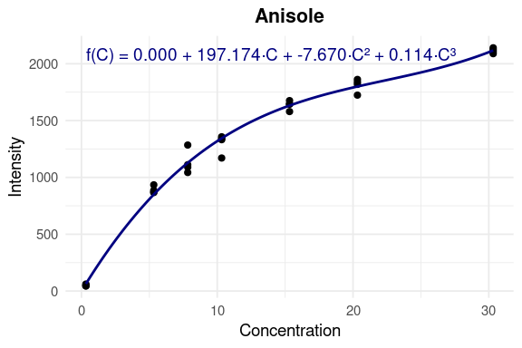

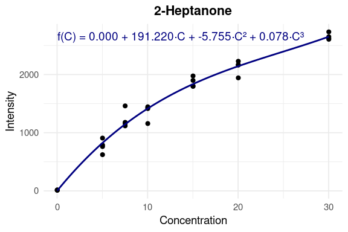

<table class="table" style="width: auto !important; margin-left: auto; margin-right: auto;">
<caption>
Polynomial coefficients (degree 3, no intercept)
</caption>
<thead>
<tr>
<th style="text-align:left;">
Analyte
</th>
<th style="text-align:center;">
a0
</th>
<th style="text-align:center;">
a1
</th>
<th style="text-align:center;">
a2
</th>
<th style="text-align:center;">
a3
</th>
</tr>
</thead>
<tbody>
<tr>
<td style="text-align:left;">
Anisole
</td>
<td style="text-align:center;">
0
</td>
<td style="text-align:center;">
197.1742
</td>
<td style="text-align:center;">
-7.6705
</td>
<td style="text-align:center;">
0.1145
</td>
</tr>
<tr>
<td style="text-align:left;">
2-Heptanone
</td>
<td style="text-align:center;">
0
</td>
<td style="text-align:center;">
191.2197
</td>
<td style="text-align:center;">
-5.7550
</td>
<td style="text-align:center;">
0.0775
</td>
</tr>
</tbody>
</table>
<table class="table" style="width: auto !important; margin-left: auto; margin-right: auto;">
<caption>
Model fit metrics
</caption>
<thead>
<tr>
<th style="text-align:left;">
Analyte
</th>
<th style="text-align:center;">
R²
</th>
<th style="text-align:center;">
Adjusted R²
</th>
<th style="text-align:center;">
RSE
</th>
<th style="text-align:center;">
RSS
</th>
</tr>
</thead>
<tbody>
<tr>
<td style="text-align:left;">
anisole
</td>
<td style="text-align:center;">
0.9984
</td>
<td style="text-align:center;">
0.9982
</td>
<td style="text-align:center;">
60.6589
</td>
<td style="text-align:center;">
91987.62
</td>
</tr>
<tr>
<td style="text-align:left;">
heptanone
</td>
<td style="text-align:center;">
0.9960
</td>
<td style="text-align:center;">
0.9955
</td>
<td style="text-align:center;">
110.8239
</td>
<td style="text-align:center;">
307048.44
</td>
</tr>
</tbody>
</table>
<table class="table" style="width: auto !important; margin-left: auto; margin-right: auto;">
<caption>
Polynomial equations
</caption>
<thead>
<tr>
<th style="text-align:left;">
Analyte
</th>
<th style="text-align:left;">
Equation
</th>
</tr>
</thead>
<tbody>
<tr>
<td style="text-align:left;">
Anisole
</td>
<td style="text-align:left;">
f(C) = 197.174·C + -7.670·C² + 0.114·C³
</td>
</tr>
<tr>
<td style="text-align:left;">
2-Heptanone
</td>
<td style="text-align:left;">
f(C) = 191.220·C + -5.755·C² + 0.078·C³
</td>
</tr>
</tbody>
</table>

# Harmonization

## Anisole

``` r
res_anisole <- harmonize(pool_anisole, su_anisole)
```

| Parameter | Value | Error  | Units |
|:---------:|:-----:|:------:|:-----:|
|   Scale   | 0.562 | ±0.095 |   –   |
|   Shift   | 0.930 | ±1.619 |  ppb  |

Harmonization parameters and uncertainty (Anisole)

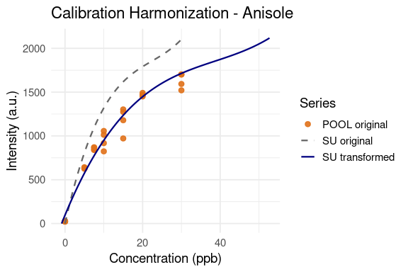

### Final Calibration Curves

Calibration curves without harmonization (baseline model) and with pool
harmonization (proposed model).

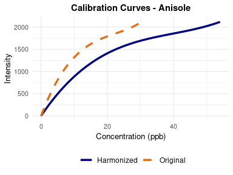

## Heptanone

``` r
res_heptanone <- harmonize(pool_heptanone, su_heptanone)
```

| Parameter | Value | Error  | Units |
|:---------:|:-----:|:------:|:-----:|
|   Scale   | 0.815 | ±0.11  |   –   |
|   Shift   | 2.940 | ±1.611 |  ppb  |

Harmonization parameters and uncertainty (Heptanone)

``` r
plot_harmonization(res_heptanone, title = "Calibration Harmonization - 2- Heptanone")
```


### Final Calibration Curves

Calibration curves without harmonization (baseline model) and with pool
harmonization (proposed model).

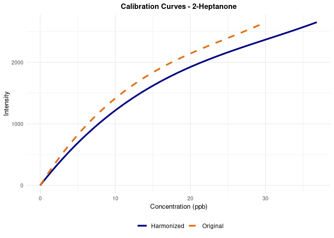

## Extrapolation

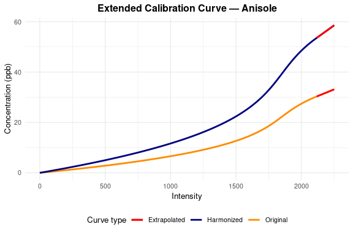


# Concentration Prediction

## Prediction Without Scaling the Curve (Baseline)

<table class="table" style="width: auto !important; margin-left: auto; margin-right: auto;">
<caption>
Estimated concentrations across datasets (baseline calibration)
</caption>
<thead>
<tr>
<th style="text-align:left;">
Sample
</th>
<th style="text-align:center;">
Analyte
</th>
<th style="text-align:center;">
Spiked Conc. (ppb)
</th>
<th style="text-align:right;">
Intensity (a.u.)
</th>
<th style="text-align:right;">
Estimated Conc. (ppb)
</th>
</tr>
</thead>
<tbody>
<tr>
<td style="text-align:left;">
pool
</td>
<td style="text-align:center;">
anisole
</td>
<td style="text-align:center;">
10
</td>
<td style="text-align:right;">
1012.9812
</td>
<td style="text-align:right;">
6.7167
</td>
</tr>
<tr>
<td style="text-align:left;">
pool
</td>
<td style="text-align:center;">
anisole
</td>
<td style="text-align:center;">
30
</td>
<td style="text-align:right;">
1593.1510
</td>
<td style="text-align:right;">
14.4560
</td>
</tr>
<tr>
<td style="text-align:left;">
pool
</td>
<td style="text-align:center;">
anisole
</td>
<td style="text-align:center;">
0
</td>
<td style="text-align:right;">
21.8578
</td>
<td style="text-align:right;">
0.1115
</td>
</tr>
<tr>
<td style="text-align:left;">
pool
</td>
<td style="text-align:center;">
anisole
</td>
<td style="text-align:center;">
20
</td>
<td style="text-align:right;">
1462.1706
</td>
<td style="text-align:right;">
12.0458
</td>
</tr>
<tr>
<td style="text-align:left;">
pool
</td>
<td style="text-align:center;">
anisole
</td>
<td style="text-align:center;">
5
</td>
<td style="text-align:right;">
642.6036
</td>
<td style="text-align:right;">
3.7850
</td>
</tr>
</tbody>
</table>

## Prediction Scaling the Curve (Proposed Method)

<table class="table" style="width: auto !important; margin-left: auto; margin-right: auto;">
<caption>
Estimated concentrations across datasets (proposed calibration)
</caption>
<thead>
<tr>
<th style="text-align:left;">
Sample
</th>
<th style="text-align:center;">
Analyte
</th>
<th style="text-align:center;">
Spiked Conc. (ppb)
</th>
<th style="text-align:right;">
Intensity (a.u.)
</th>
<th style="text-align:right;">
Estimated Conc. (ppb)
</th>
</tr>
</thead>
<tbody>
<tr>
<td style="text-align:left;">
pool
</td>
<td style="text-align:center;">
anisole
</td>
<td style="text-align:center;">
10
</td>
<td style="text-align:right;">
1012.9812
</td>
<td style="text-align:right;">
11.9554
</td>
</tr>
<tr>
<td style="text-align:left;">
pool
</td>
<td style="text-align:center;">
anisole
</td>
<td style="text-align:center;">
30
</td>
<td style="text-align:right;">
1593.1510
</td>
<td style="text-align:right;">
25.7311
</td>
</tr>
<tr>
<td style="text-align:left;">
pool
</td>
<td style="text-align:center;">
anisole
</td>
<td style="text-align:center;">
0
</td>
<td style="text-align:right;">
21.8578
</td>
<td style="text-align:right;">
0.1985
</td>
</tr>
<tr>
<td style="text-align:left;">
pool
</td>
<td style="text-align:center;">
anisole
</td>
<td style="text-align:center;">
20
</td>
<td style="text-align:right;">
1462.1706
</td>
<td style="text-align:right;">
21.4412
</td>
</tr>
<tr>
<td style="text-align:left;">
pool
</td>
<td style="text-align:center;">
anisole
</td>
<td style="text-align:center;">
5
</td>
<td style="text-align:right;">
642.6036
</td>
<td style="text-align:right;">
6.7372
</td>
</tr>
</tbody>
</table>

# Error Calculation

## Anisole (Non-Endogenous)

In this section we evaluate the accuracy of the estimated concentrations
obtained from the calibration models.  
For each measurement we define the **error** as:

$$
\varepsilon_i = \widehat{C}_i - C_i,
$$

where  
- $C_i$ = true (spiked) concentration, since anisole is non endogenous
analyte  
- $\widehat{C}_i$ = estimated concentration from the calibration model.

To summarise the error magnitude we use the **root-mean-square error
(RMSE)**:

$$
\mathrm{RMSE}
  = \sqrt{\frac{1}{n} \sum_i (\,\widehat{C}_i - C_i\,)^2 }.
$$

RMSE gives a single value (in ppb) that increases when predictions
deviate from the true concentration.  
We compare RMSE between:

- **Baseline model** (using the original SU calibration curve)  
- **Proposed model** (using the harmonised and scaled calibration curve)

for: - Pool sample  
- Individual samples (s1–s3, s4)  
- Global error across all samples  
- Each concentration level

The following tables and plots present these comparisons.

### RMSE in Pool

<table class="table" style="width: auto !important; margin-left: auto; margin-right: auto;">
<caption>
RMSE in pool (anisole)
</caption>
<thead>
<tr>
<th style="text-align:left;">
Method
</th>
<th style="text-align:right;">
RMSE (ppb)
</th>
</tr>
</thead>
<tbody>
<tr>
<td style="text-align:left;">
Baseline
</td>
<td style="text-align:right;">
6.993950
</td>
</tr>
<tr>
<td style="text-align:left;">
Proposed
</td>
<td style="text-align:right;">
2.227297
</td>
</tr>
</tbody>
</table>

### RMSE in Individual Samples

<table class="table" style="width: auto !important; margin-left: auto; margin-right: auto;">
<caption>
Global RMSE (anisole)
</caption>
<thead>
<tr>
<th style="text-align:left;">
Method
</th>
<th style="text-align:right;">
RMSE (ppb)
</th>
</tr>
</thead>
<tbody>
<tr>
<td style="text-align:left;">
Baseline
</td>
<td style="text-align:right;">
5.837247
</td>
</tr>
<tr>
<td style="text-align:left;">
Proposed
</td>
<td style="text-align:right;">
3.255603
</td>
</tr>
</tbody>
</table>

### RMSE vs Concentration Level

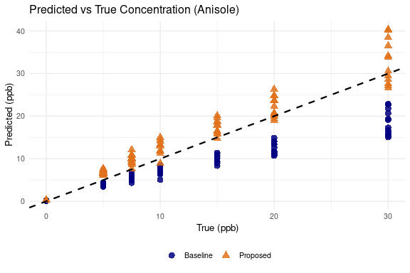

### Predicted vs True Concentration

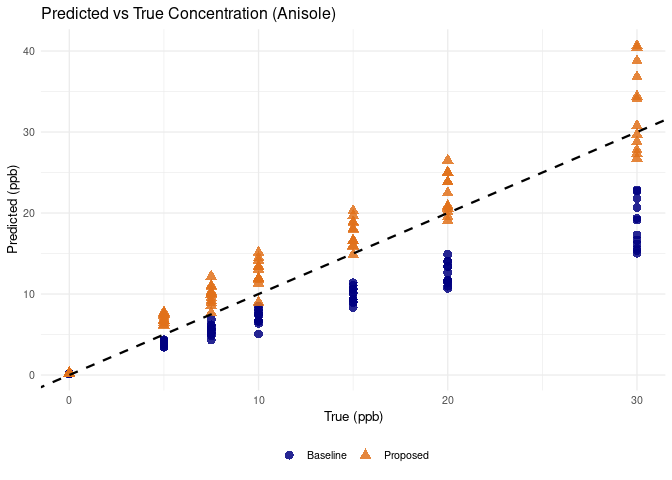

## 2-Heptanone (Endogenous)

Unlike anisole, **2-heptanone is naturally present** in urine without
spiking.  
Therefore, to compute the prediction error, we must estimate the
**endogenous (baseline) concentration** $C_0$ for each sample.

We treat each sample as a shifted version of the SU calibration curve.  
Using the affine alignment model:

$$
f_{\text{sample}}(C_{\text{total}}) \approx f_{\text{SU}}\!\left(\alpha \cdot C_{\text{total}}\right),
$$

we obtain:

- $C_0$: endogenous concentration (offset)
- $\alpha$: scale factor due to matrix effects

The **true concentration** for each point becomes:

$$
C_{\text{total}} = C + C_0
$$

All RMSE calculations use this corrected concentration.

### Endogenous Concentration Estimation

<table class="table" style="width: auto !important; margin-left: auto; margin-right: auto;">
<caption>
Estimated endogenous concentrations (2-Heptanone)
</caption>
<thead>
<tr>
<th style="text-align:left;">
Sample
</th>
<th style="text-align:left;">
Analyte
</th>
<th style="text-align:right;">
C0 (ppb)
</th>
<th style="text-align:right;">
Error
</th>
</tr>
</thead>
<tbody>
<tr>
<td style="text-align:left;">
pool
</td>
<td style="text-align:left;">
heptanone
</td>
<td style="text-align:right;">
2.940
</td>
<td style="text-align:right;">
1.611
</td>
</tr>
<tr>
<td style="text-align:left;">
s1
</td>
<td style="text-align:left;">
heptanone
</td>
<td style="text-align:right;">
1.005
</td>
<td style="text-align:right;">
0.594
</td>
</tr>
<tr>
<td style="text-align:left;">
s2
</td>
<td style="text-align:left;">
heptanone
</td>
<td style="text-align:right;">
0.603
</td>
<td style="text-align:right;">
0.435
</td>
</tr>
<tr>
<td style="text-align:left;">
s3
</td>
<td style="text-align:left;">
heptanone
</td>
<td style="text-align:right;">
3.568
</td>
<td style="text-align:right;">
0.922
</td>
</tr>
<tr>
<td style="text-align:left;">
s4
</td>
<td style="text-align:left;">
heptanone
</td>
<td style="text-align:right;">
4.271
</td>
<td style="text-align:right;">
0.845
</td>
</tr>
</tbody>
</table>

### Error Calculation

*Same RMSE approach as anisole, but using total concentration.*

### RMSE in pool

<table class="table" style="width: auto !important; margin-left: auto; margin-right: auto;">
<caption>
RMSE in pool (2-Heptanone)
</caption>
<thead>
<tr>
<th style="text-align:left;">
Method
</th>
<th style="text-align:right;">
RMSE (ppb)
</th>
</tr>
</thead>
<tbody>
<tr>
<td style="text-align:left;">
Baseline
</td>
<td style="text-align:right;">
3.747469
</td>
</tr>
<tr>
<td style="text-align:left;">
Proposed
</td>
<td style="text-align:right;">
2.265698
</td>
</tr>
</tbody>
</table>

### RMSE in Individual Samples

<table class="table" style="width: auto !important; margin-left: auto; margin-right: auto;">
<caption>
Global RMSE (2-Heptanone)
</caption>
<thead>
<tr>
<th style="text-align:left;">
Method
</th>
<th style="text-align:right;">
RMSE (ppb)
</th>
</tr>
</thead>
<tbody>
<tr>
<td style="text-align:left;">
Baseline
</td>
<td style="text-align:right;">
2.395582
</td>
</tr>
<tr>
<td style="text-align:left;">
Proposed
</td>
<td style="text-align:right;">
2.680237
</td>
</tr>
</tbody>
</table>

### RMSE vs Concentration Level

*Grouped by spiked concentration*

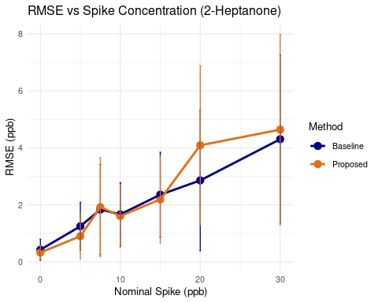

### Predicted vs True (Total) Concentration

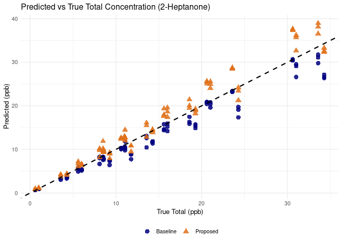

## Model Comparison

### Statistical test

Wilcoxon paired test

**ANISOLE**

    ## 
    ##  Wilcoxon signed rank test with continuity correction
    ## 
    ## data:  df_anisole$abs_error_baseline and df_anisole$abs_error_proposed
    ## V = 4558, p-value = 5.221e-05
    ## alternative hypothesis: true location shift is not equal to 0

**HEPTANONE**

    ## 
    ##  Wilcoxon signed rank test with continuity correction
    ## 
    ## data:  df_heptanone$abs_error_baseline and df_heptanone$abs_error_proposed
    ## V = 3228, p-value = 0.8537
    ## alternative hypothesis: true location shift is not equal to 0

<table class="table" style="width: auto !important; margin-left: auto; margin-right: auto;">
<caption>
Paired Wilcoxon signed-rank test on absolute errors (Baseline vs
Proposed)
</caption>
<thead>
<tr>
<th style="text-align:left;">
Analyte
</th>
<th style="text-align:center;">
Test
</th>
<th style="text-align:center;">
V_statistic
</th>
<th style="text-align:center;">
P_value
</th>
<th style="text-align:center;">
Interpretation
</th>
</tr>
</thead>
<tbody>
<tr>
<td style="text-align:left;">
Anisole
</td>
<td style="text-align:center;">
Wilcoxon signed-rank (paired)
</td>
<td style="text-align:center;">
4558
</td>
<td style="text-align:center;">
0.0001
</td>
<td style="text-align:center;">
Significant difference between models
</td>
</tr>
<tr>
<td style="text-align:left;">
2-Heptanone
</td>
<td style="text-align:center;">
Wilcoxon signed-rank (paired)
</td>
<td style="text-align:center;">
3228
</td>
<td style="text-align:center;">
0.8537
</td>
<td style="text-align:center;">
No significant difference between models
</td>
</tr>
</tbody>
</table>

A paired Wilcoxon signed-rank test was applied to the absolute
prediction errors obtained with the baseline and proposed calibration
models, pairing measurements by SampleID. For anisole, a statistically
significant difference was observed (V = 4558, p = 5.2e-05), indicating
a clear reduction in error when using the proposed harmonised
calibration. In contrast, no significant difference was found for
2-heptanone (V = 3228, p = 0.85), suggesting that the proposed method
does not provide a measurable improvement over the baseline model for
this endogenous compound.


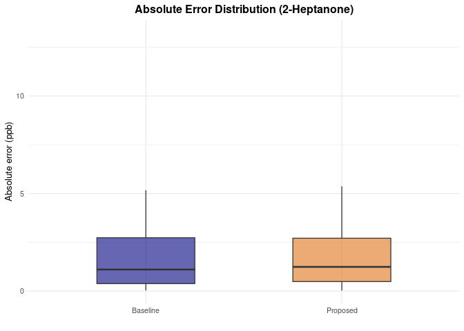

## Discussion

The error is lower with our methodology in anisole but not in heptanone.
This is probably due to the fact that the effect of the matrix is lower
for 2-heptanone.

Since we have a whole calibration for each individual sample, we can
estimate the scale wrt the synthetic urine.

| Sample |  Analyte  | Scale ± Error |
|:------:|:---------:|:-------------:|
|  pool  |  anisole  | 0.544 ± 0.090 |
|  pool  | heptanone | 0.815 ± 0.110 |
|   s1   |  anisole  | 0.725 ± 0.041 |
|   s1   | heptanone | 0.942 ± 0.056 |
|   s2   |  anisole  | 0.661 ± 0.042 |
|   s2   | heptanone | 0.978 ± 0.045 |
|   s3   |  anisole  | 0.553 ± 0.082 |
|   s3   | heptanone | 0.924 ± 0.068 |
|   s4   |  anisole  | 0.553 ± 0.051 |
|   s4   | heptanone | 0.779 ± 0.052 |

Estimated scaling factors with uncertainty


For anisole, the individual samples deviate more from the pool
reference, while for 2-heptanone the scaling factors stay much closer to
1 (synthetic urine), indicating that matrix effects are smaller and the
harmonization may not be necessary or helpful in this case.
